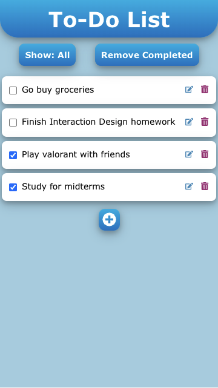

## Design Decisions:
When designing the To-Do list, our main design decisions were centered around the following aspects:

1. Where the various buttons (add task, delete, edit, show all/uncompleted) should go
2. How to style the tasks themselves
3. How to design the add task button

We eventually decided on the following layout for the buttons:

Our reasoning was that the add button should be placed below the other tasks so that users would know exactly where the newly created task would go. The group-action buttons (show/delete all) were placed near the top to follow similar list item conventions (i.e. group actions at the top of the gmail inbox). Similarly, we added the edit and individual delete buttons to each task following mobile UI design conventions (in the form of a "pencil" and "trashcan" icon button).

As discussed above, the tasks themselves were styled to follow similar UI design conventions. Each task takes up an entire row of space and has adequate space for a checkbox, edit, and delete button. Similar to the way files are renamed, clicking on the edit button allows users to edit the task name directly in-line.

Finally, we wanted our add button to allow users to see exactly where/how the new task would be created. Thus, the add task button is the same width and height as our tasks. Clicking on the button causes a textbox to open up on the button for the title of the task. After the user confirms their title, a new task is created in the same spot as the add task button, and the button is moved down.

## Alternative Designs:

In the above image, we had 3 designs that we were thinking of pursuing. Our approach was to individually create our own ideas of an interface (shown by diagrams 1 and 2), then combine aspects of both interfaces for an ultimate third and final interface (shown by diagram 3). The rationale for the layout and functionalities are described in the design decisions section above.

## User Testing:
Regarding user testing, we talked to several classmates and showed them pictures of our HTML/CSS. We asked them to list out the functionalities they saw and made sure that the interface was simple and intuitive. It seemed that the icons for deleting/editing a task and the checkbox to mark a task as complete all made sense to users. This was also true for the plus button at the bottom of the list that allows users to add another task. One piece of feedback we received focused on the color scheme, which could be modernized and made more appealing. With more time, this could be improved upon.

## Challenges:
Typically in designing interfaces, it can be difficult to achieve a proper layout for all of the components. However, for this simple to-do list, we were able to arrange the buttons and tasks without too much difficulty. One time-consuming task was trying to figure out how to make the color scheme look nice without too complicated styling. Despite our efforts, we still received feedback from users that the colors felt old. In the future, we will continue working on this aspect of our interface.

## Parts Of Design We Are Proud Of:
We believe the addition of icons for edit and delete in the form of a pencil and trashcan is a simple way to notion to the user that they can change or remove the contents of a task. These icons are quite universal across mobile UIs and help to save space while keeping functionality apparent. Additionally, we added box shadows to the buttons and tasks to make them pop out slightly when compared to the light background. This directs the user's attention to these buttons and tasks and makes the interface look more animated.
